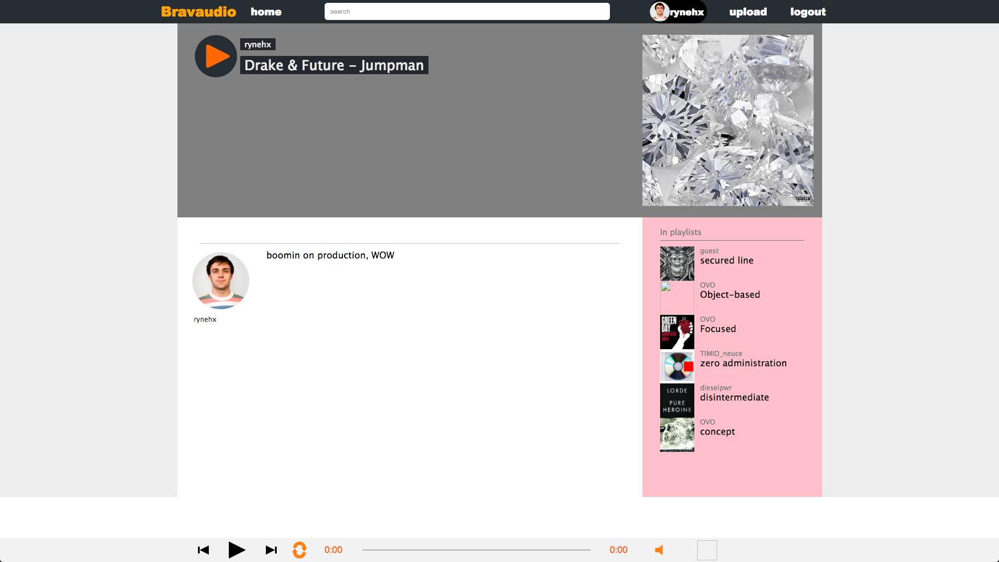

# Bravaudio

[Bravaudio live][heroku] **NB:** This should be a link to your production site

[heroku]: http://www.bravaudio.herokuapp.com

Bravaudio is a fullstack music hosting app inspired by soundcloud.  It utilizes Ruby on Rails on the backend, a PostgreSQL database, and React.js with a Flux architectural framework on the frontend.  

## Features & Implementation

Features of Bravaudio includes ability to play music and select music and playlist from other users.

### Single-Page App

FresherNote is truly a single-page; all content is delivered on one static page.  The root page listens to a `SessionStore` and renders content based on a call to `SessionStore.currentUser()`.  Sensitive information is kept out of the frontend of the app by making an API call to `SessionsController#current_user`.

```ruby
def current_user
  if current_user
    @user = current_user
    render "api/users/show"
  else
    @errors = nil
    render "api/shared/error", status: 404
  end
end
  ```

### Listening to Tracks

  On the database side, the tracks are stored in one table in the database, which contains columns for `id`, `author_id`, `description`, `image_url`, `audio_url`, `created_at`, and `updated_at`.  Upon login, an API call is made to the database which joins the user table and the track table on `user_id` and filters by the current user's `id`.  These notes are held in the `TrackStore` and displayed on the home page;

  To play the tracks, the track component in the `TrackStore` is pushed into the `currentPlayingTrack` of the `MusicStore`. The `MusicBar` listens to the `MusicStore` and plays tracks accordingly;




### Listening to Playlists

The playlists are joined with `track-playlist-joinings` to create a playlist with its tracks. The `playlist` table contains `id`, `title`, `image_url`, `author_id`, `description`. The playlist api carries its tracks which are inserted into the `MusicStore`. The `MusicStore` will cycle through the `track`s.
